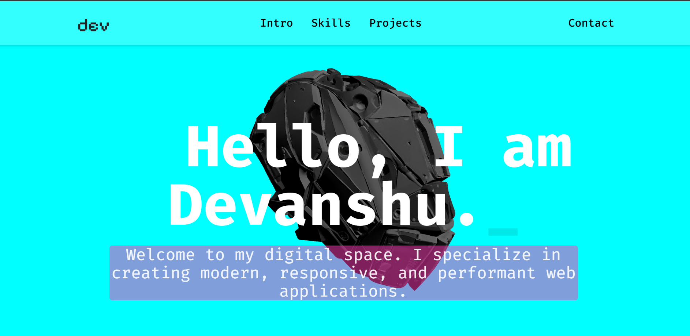

# Neon Cyberpunk Portfolio



> A futuristic, cyberpunk-themed portfolio website designed as an interactive, holographic interface. This project focuses on a high-end user experience, combining a unique boot-up sequence with advanced 3D and scroll-based animations to leave a lasting impression.

**Live Site:**=(https://portfolio-ten-sepia-89.vercel.app/)  <!-- 👈 -->

##✨ Core Systems & Features

This portfolio isn’t just a static page — it’s an interactive playground where design, motion, and code fuse together. Each system is crafted to create an immersive journey for anyone who visits.

## 🚀 Feature Overview

- 👾 **Immersive Boot Sequence**  
  Custom ASCII-art loader + interactive terminal. Visitors must type the *right command* to unlock the portfolio — a nod to retro hacking consoles.  

- 🌀 **3D Scroll-Link Engine**  
  A central 3D model syncs with your scroll. Powered by **GSAP ScrollTrigger**, it rotates, shifts, and reacts in real-time as you move down the page.  

- 💧 **Fluid Scroll Physics**  
  Integrated with **Lenis** for buttery-smooth scrolling. Every animation feels natural, almost liquid.  

- 🔮 **Glassmorphism UI**  
  Content sections float on translucent glass panels with soft blur, creating depth against a dynamic 3D background.  

- ⚡ **Neon & Glitch FX**  
  UI cards glow with neon edges, while the contact button features a signature *glitch animation* for that cyberpunk vibe.  

- 🎬 **Interactive Components**  
  From rolling hover-text links to animated progress bars, **Framer Motion** makes every interaction feel alive.  

- 📱 **Seamless Responsiveness**  
  Mobile-first design ensures a flawless experience on any device, from widescreen monitors to smartphones.  

---

## 🛠️ Tech Stack & Tools

This project was built using a modern, high-performance tech stack designed for creating rich, animated web experiences.

| Technology             | Purpose                                           |
| ---------------------- | ------------------------------------------------- |
| **React** | Core frontend library for building the UI         |
| **Vite** | Next-generation frontend tooling for development  |
| **Tailwind CSS** | A utility-first CSS framework for rapid styling   |
| **Three.js / R3F** | For rendering the interactive 3D skull model      |
| **GSAP (ScrollTrigger)** | For the professional-grade scroll animations    |
| **Framer Motion** | For UI animations (skills, projects)              |
| **Lenis** | For the premium smooth scrolling                  |
| **React Simple Typewriter** | For the initial terminal typing animation      |
| **Vercel** | Platform for deployment and hosting               |

---

**Install all the necessary NPM packages:**
    ```
    npm install
    ```
**Run the development server:**
    ```
    npm run dev
    ```
## 📧 Contact

**Devanshu Puri**
* **GitHub:** [github.com/devanshu-puri](https://github.com/devanshu-puri)
* **LinkedIn:** [linkedin.com/in/devanshu-puri-77b68a303](https://www.linkedin.com/in/devanshu-puri-77b68a303)
